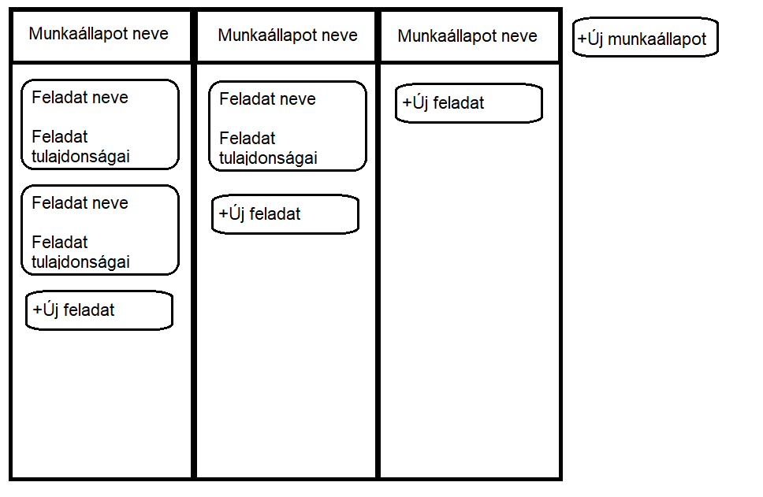

1\. Áttekintés
==============
Prioritást élvez a hozzáférhetőség illetve az egyszerűség. Nagyon fontos az, hogy egyértelmű legyen a használata, felhasználóbarát legyen.
Törekszünk egy olyan design kialakítására, amely önmagától értetődő, különösebb dokumentáció használatot ne igényeljen az alkalmazás.

Elképzelésünk szerint nem tervezünk mikrotranzakciókat beleépíteni a szoftverünkbe, továbbá ez nem egy kalendáriumnak készül.

2\. Jelenlegi helyzet
=====================
A megrendelő szeretné, hogy könnyen, gördülékenyen tudja kezelni mindennapjait, egy megfelelő napirend tervező lista használatával. Ehhez egy interneten keresztül működő weboldalon található teendő listát rendelt meg.
Weboldalunk **minden látogató igényét kielégíti** azáltal, hogy XXI. századi technológiával a **Hálózaton keresztül működik**, és itt **bárki** feljegyezheti az előtte álló, vagy akár a kész feladatokat, **ingyenes** táblák használatával, teendőikhez időpontokat rendelve, ezzel **lecserélve elődjét: a papírt**. Valamint segíti a **környezetvédő** szervezetek munkáját a papírlapok és műanyag tollak elhagyásával, mindezek mellett nagyszerű fiatalos designt alkalmazva.
A megrendelő eddig csak papír alapú teendő listát használt, viszont látva a lehetőséget a **környezetbarát**, **gyors** és **egyszerűen hordozható** megoldásra, nálunk keresett számára megfelelő szolgáltatást.

3\. Követelménylista
====================

| ID | Leírás |
|----| ------ |
|K01| A feladatok jellemzésére lehetőség lesz mozgatható kártyák segítségével, amelyeken megadható lesz a feladat neve, és opcionálisan a személy vagy személyek akik a feladatot elvégzik majd. A kártyákon szintén megadható a feladatvégzés tervezett dátuma és időtartama.|
|K02| A munkastádiumok oszlopokként jelennek meg a weboldalon, az egyes oszlopokba mozgatható lesz bármelyik feladatot jelölő kártya. A kártyák a munkastádiumok között drag and drop módszerrel áthelyezhetőek lesznek. |
|K03| A létrehozott munkavégzési stádiomokat jelölő oszlopokban lehetőség lesz új feladatkártyák hozzáadására. A már létező kártyákra kattintva lehetőség lesz az azokon szereplő adatok módosítására, és a kártya törlésére.|
|K04| A munkavégzési stádiumokat jelölő oszlopoktól jobbra lesz egy gomb, amellyel új oszlopot lehet létrehozni. Az oszlopok fejlécén megadható a név. Az oszlopok sorrendje megváltoztatható lesz. A fejlécre kattintva lehetőség lesz az átnevezésre, és oszlop törlésére is.|
   

4\. Jelenlegi üzleti folyamatok
===============================
   

   
5\. Igényelt üzleti folyamatok
==============================
   

6\. Képernyő terv
=================

7\. Forgatókönyv
================

8\. Funkció - követelmény megfeleltetés
=======================================

   
9\.  Fogalomszótár
===============

HTML: A HTML (angolul: HyperText Markup Language=hiperszöveges jelölőnyelv) egy leíró nyelv, melyet weboldalak készítéséhez fejlesztettek ki, és mára már internetes szabvánnyá vált a W3C (World Wide Web Consortium) támogatásával.

Forrás: https://hu.wikipedia.org/wiki/HTML

A CSS (Cascading Style Sheets, magyarul: lépcsőzetes stíluslapok) a számítástechnikában egy stílusleíró nyelv, mely a HTML vagy XHTML típusú strukturált dokumentumok megjelenését írja le. Ezenkívül használható bármilyen XML alapú dokumentum stílusának leírására is, mint például az SVG, XUL stb.

A CSS specifikációját a World Wide Web Consortium felügyeli.

Forrás: https://hu.wikipedia.org/wiki/Cascading_Style_Sheets

A JavaScript programozási nyelv egy objektumorientált, prototípus-alapú szkriptnyelv, amelyet weboldalakon elterjedten használnak.

Forrás: https://hu.wikipedia.org/wiki/JavaScript

Cross-Platform: A platformfüggetlenség vagy többplatformosság, illetve multi-platform fogalma olyan számítógépes programokra, operációs rendszerekre, programozási nyelvekre vagy más számítógépes szoftverekre és implementációikra vonatkozik, amelyek több számítógépes platformon képesek működni.

Forrás: https://hu.wikipedia.org/wiki/Platformf%C3%BCggetlens%C3%A9g

Reszponzív weboldal: A reszponzív weboldal (RWD) egy olyan megközelítéssel tervezett weboldal, amelynek a célja az, hogy optimális megjelenést biztosítson - könnyű olvashatóság, egyszerű navigáció a lehető legkevesebb átméretezéssel és görgetéssel - a legkülönfélébb eszközökön.

Forrás: https://hu.wikipedia.org/wiki/Reszponz%C3%ADv_weboldal
