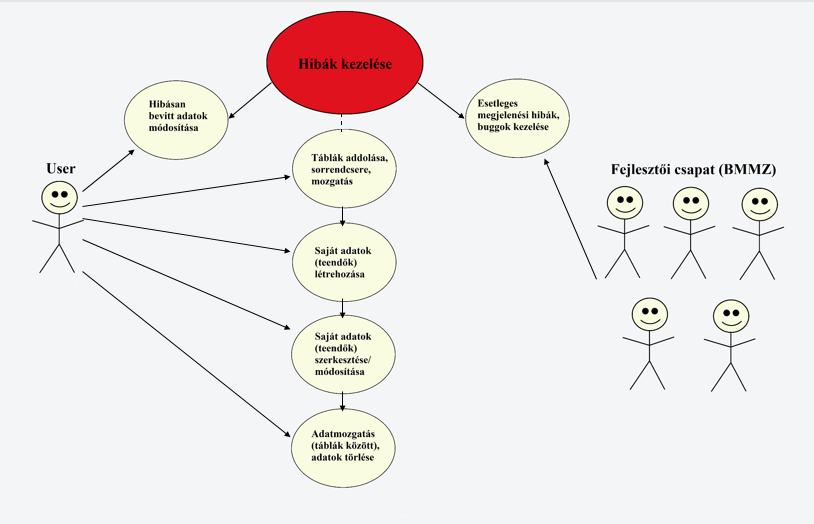

1\. A rendszer célja
==============
Alkalmazásunk letiszult, illetve egyszerű célokkal rendelkezik. A hétköznapi élet egyszerűsítése elsődleges prioritást élvez. Az életünk szerves részét képezi a bevásárlás. Ezen tevékenység során gyakran elfelejtjük, hogy mit is akarunk vásárolni. Ezt a problémát szeretnénk elsősorban elkerülni.

Mi sem letisztultabb és egyszerűbb annál, hogy elindítjuk az alkalmazást és már hozzá is tudjuk adni a teendőinket az alkalmazásban, melyet később módosíthatunk vagy akár törölhetünk.

Annak érdekében, hogy átlátható maradjon az alkalmazás, a design-ra nagyon nagy figyelmet szentelünk. A mostanában divatos szimpla design-t fogjuk alkalmazni.

Az egyszerűség részét képezi az, hogy egy olyan TODO alkalmazást hozzunk létre, melynek használatához fiókösszekapcsolás illetve regisztráció nem szükséges.

2\. Projektterv
==============
### Projektszerepkörök, felelősségek:
Scrum master: Hernádi Mihály\
Product owner: Hernádi Mihály
### Projektmunkások és felelősségek
**<u> Backend munkálatok:** </u>\
Balázs Bence, Hernádi Mihály, Kiss Marcell, Osztós Zsombor, Szilágyi Mihály
*Feladatuk a képernyőn található gombok mögöttes funkcióinak beállítása.*\
**<u> Frontend munkálatok:** </u>\
Balázs Bence, Hernádi Mihály, Kiss Marcell, Osztós Zsombor, Szilágyi Mihály
*A felsorolt személyek a weboldal elemeinek megjelenéséért (a gombok, táblák, és egyéb kiegészítők megjelenítéséért) felelősek.*

Mivel egy miniprojektről van szó a backend és frontend munkákat együttesen végezzük. A projekt apróbb kódrészenként/részfeladatonként lesz felosztva a csapat tagjai között.

**<u>Ütemterv:**</u>


|  **Funkció/Story** | **Feladat/Task**  |  **Prioritás** | **Becslés**  |**Aktuális becslés**   |  **Eltelt idő**  |**Hátralévő idő**   |
|---|---|---|---|---|---|---|
|Követelmény specifikáció  |   | 0  |4   | 4  |4   |0   |
|Funkcionális specifikáció |   | 0  |5   |5   |5   | 0  |
|Rendszerterv |   |0   |9   |9   |6   |3   |
|Kódháttér elkészítése|Gombok működésének beállítása   |1   |3   |3   |0   |3   |
|Felület elkészítése|Gombok elhelyezése,háttér és egyéb színek,betűtípusok   |2   |8   |8   |0   |8   |
```
```
3\. Üzleti folyamatok modellje
==============


4\. Követelmények
=================

Funkcionális követelmények:
-------------------------


A készítendő program egy böngészőben megnyitható html oldal, aminek a tartalmát a felhasználó módosíthatja. 
Az alkalmazás lehetőséget ad elvégzendő feladatok adatainak tárolására, rendszerezésére és hatékony számon tartására.
Nyomon követhetővé teszi a feladatok dolgozók közötti tervezett elosztását, és kitűzött végrehajtási idejét is.
Az egyes feladatok állapotát számon tartani oszlopokba rendezett kategóriák segítségével lehet maj megtenni, ezek az oszlopok különböző munkastádiumokat jelölnek.
A kitűzött feladatok listája bővíthető lesz, és hibás adatbevitel vagy a munkaterv változása miatt lehetőség lesz a kitűzött feladatokon feltüntetett adatok módosítására, valamint feladatok törlésére is. A feladatok állapotát számon tartó kategóriák listája szintén bővíthető, a kategórianevek módosíthatók lesznek. Lehetőség lesz szükségtelenné váló kategóriák törlésére is.
Az egyes feladatok létrehozás után a kategóriák valamelyikéhez lesznek rendelve, és a munka előrehaladtával a munka jelenlegi állapotát tükröző kategóriába helyezhetőek át.

Nem funkcionális követelmények:
------------------------------

Törvényi előírások, szabványok:
------------------------------

5\. Funkcionális terv
Webalkalmazásunk célja, hogy a hétköznapi emberek mindennapjait könnyítsük meg, ezáltal törekedünk az alkalmazás átláthatóságára, egyszerűségére, és kényelmes használatára.

Rendszerszereplők:
====================
Admin

User

Rendszerhasználati esetek és lefutásaik:
====================

Admin:
------------------------------
● Beléphet bármilyen szereplőként teljes hozzáférése van a rendszerhez

● A felhasználói adatokat látják, változtathatják

● Felhasználó hozzáadására, törlésére van lehetőségük

● Felhasználói adatok módosítása

● Feladat tábla hozzáadása, szerkesztése, törlése

● Időpont rendelése táblához

6\. Fizikai környezet
====================

7\. Implementációs terv
=======================

A rendszer egy html oldalból áll, a funkcionalitást JavaScrip kód biztosítja, a megjelenés és elrendezés pedig egy css stíluslappal történik. A html oldal böngészőben betölthető, akár lokális fájlrendszerből, szerver oldali komponense nincs. A Vue.js és a jQuery JavaScript keretrendszereket használjuk a fejlesztés során. A kategóriák és feladatok száma dinamikusan változik, ennek kezelését megkönnyíti a Vue.js keretrendszer. Új feladat vagy kategória létrehozásánál és módosításánál modális dialógus panelt használunk, ami azt jelenti, hogy amíg a dialógus nyitva van, addig a felhasználó csak ennek elemeire kattinthat, csak ezeket használhatja, a felhasználói felület egyéb elemei zároltak számára. Ezt és a drag and drop funkcionalitást a Vue.js keretrendszer segítségével valósítjuk meg.

### Adatszerkezet

Létre kell hozni egy feladat és egy kategória osztályt amelyek adattagjaiban tároljuk a jellemzőket. A feladatok és kategóriák példányainak tárolását tömbökben lehet megvalósítani. 

### Megjelenítés

A Vue.js v-for direktívájával a feladatok és kategóriák tömbjét be lehet járni és fel lehet építeni dinamikusan a html szerkezetet. Az oldal elrendezését (vízszintesen a kategóriák, függőlegesen a kategóriákon belül a feladatok)
css segítségével kell beállítani.

### Új katagória

Az új kategória gomb lenyomásakor egy modális dialógust kell megnyitni, amelyben egy input elemben a kategória nevét várjuk, valamint egy mentés és egy mégsem gomb szerepel.
Mentéskor a kategóriák tömbjében létrehozunk egy új osztálypéldányt, aminek neve a megadott név.

### Új feladat létrehozása

Új kategóriához hasonló dialógust használunk, amelyben megadhatóak a feladat jellemzői. A megadott jellemzőkkel egy új feladat osztálypéldányt kell létrehozni és azt a feladatok tömbjébe helyezni.

### Kategória törlése

Csak olyan kategóriát lehet törölni, amelyben nincsenek feladatok. Kategória törléskor a kategóriák tömbjéből ki kell törölni az adott elemet.

### Feladat törlése

A feladatok tömbjéből kell törölni az adott elemet.

### Kategória módosítása

A kategória nevét egy input elemben jelenítjük meg, így a felhasználó annak megnevezését átírhatja.

### Feladat módosítása

A feladat módosítása gomra kattintva egy modális dialógus panelt a kiválasztott feladat adataival kell feltölteni. Mentéskor a kiválasztott feladat jellemzőit kell felülírni a dialógus panelban megadottakkal.

### Feladat kategóriájának módosítása

A feladatokat html DOM elemeit (div) mozgathatóvá kell tenni(draggable), a kategóriák html DOM elemeibe pedig biztosítani kell a beejthetőséget (droppable). Beejtéskor az adott feladat kategóriáját a cél kategóriára kell módosítani.

### Adatok mentése és betöltése

Mentéskor a feladat és kategória tömböket szöveggé kell alakítani (JSON.stringify), és a localStorage-ben setItem-el eltárolni. Betöltéskor a localStorage-ből getItem-el ki kell venni a lementett szövegeket és a JSON.parse metódusával tömbökké kell alakítani.

8\. Tesztterv
==============
Egy alkalmazás készítésekor illetve az alkalmazás kiadása előtt nagyon fontos szerepet töltenek be a teszttervek.

A teszttervek segítségével tudunk különféle funkciók helyes működéséről meggyőződni, illetve a különféle üzleti szolgáltatások hitelesítéséről.

A szoftver kiadása előtt 2 tesztet hajtunk végre, melyek az alpha illetve beta tesztek.

### Alpha teszt

Az alpha tesztet a fejlesztő csapat fogja elvégezni. 

Ezen teszt során azt vizsgáljuk, hogy az alkalmazás hogyan reagál különboző böngészői környezetekben, illetve az adott funkciók működőképesek-e.

Ha azt tapasztaljuk, hogy az előző feltételek megfelelnek, akkor sikeres volt az alpha teszt, és következhet majd a beta teszt.

### Beta teszt

A beta tesztet a fejlesztő csapattól független, kívülálló emberek fogják végezni. 

Ennek a tesztnek az a célja, hogy a felhasználóktól visszajelzést kapjanak a fejlesztők az alkalmazás működését illetően. 

Amennyiben hibás működésbe ütköznek a felhasználók, akkor egy tesztelési naplóban felvezetik a tapasztalataikat, és azt visszaküldik a fejlesztőknek, a fejlesztők pedig megoldják a felmerült problémákat.

9\. Telepítési terv
===================


\
+1\: A rendszer prototípusa: 
===================
https://app.mockplus.com/run/prototype/Ev2Buae75BKY/wl3INyGaCnO?ps=1
